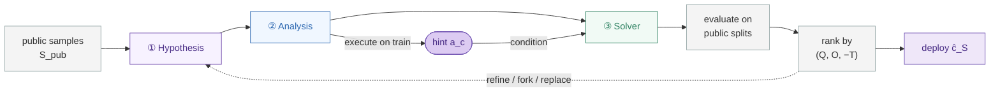

<h1 align="center">Distribution-Aware Algorithm Design with LLM Agents</h1>

<p align="center">
  <em>Learn deployment structure. Compile faster solvers.</em>
</p>

<p align="center">
  <a href="#install"></a>
  <a href="https://github.com/DLFundamentals/Program_Learning"></a>
  <a href="#citation"></a>
  <a href="#license"></a>
</p>

<p align="center">
  Saharsh Koganti<sup>1</sup> · Priyadarsi Mishra<sup>1</sup> · Pierfrancesco Beneventano<sup>2</sup> · Tomer Galanti<sup>1</sup><br>
  <sub><sup>1</sup>Texas A&amp;M University &nbsp;·&nbsp; <sup>2</sup>Massachusetts Institute of Technology</sub>
</p>

<p align="center">
  <a href="#overview">Overview</a> ·
  <a href="#results">Results</a> ·
  <a href="#how-it-works">How it works</a> ·
  <a href="#pace-2025">PACE&nbsp;2025</a> ·
  <a href="#install">Install</a> ·
  <a href="#quickstart">Quickstart</a>
</p>

---

## Overview

Hard optimization problems are rarely solved once. They run again and again inside routers, schedulers, compilers, allocators, and online services — and in deployment they rarely face arbitrary worst-case inputs. They see a recurring **distribution** of instances.

That distribution carries reusable structure: latent geometry, planted assignments, recurring bottlenecks, stable hubs, hidden backdoors, active constraints. Worst-case analysis throws all of it away.

**The question:** given only samples from an unknown deployment distribution, can an agent synthesize solver code that runs fast on future instances while keeping solution quality high?

The central object is a **solver hint** — a compact piece of distribution-specific structure, inferred from samples and compiled into a specialized solver:

$$
\underbrace{S \sim D^n}_{\text{samples}}
\xrightarrow{\text{ learn }}
\underbrace{\widehat{h}_S}_{\text{hint}}
\xrightarrow{\text{ compile }}
\underbrace{\widehat{c}_S = \mathrm{Comp}(\widehat{h}_S)}_{\text{deployed solver}}
$$

Samples are never used to memorize solutions we've already seen. They're used to discover what makes the *next* instance from the same source easier to solve.

`dasbench` is the benchmark and synthesis framework for this setting.

---

## Why it matters

Worst-case design asks for a solver that works on every input. Average-case complexity assumes the distribution is known up front. Real deployments sit in between — the distribution is unknown, but samples are cheap and plentiful.

<div align="center">

<table>
<thead>
<tr><th align="left">Setting</th><th align="left">Knows the distribution?</th><th align="left">Learned artifact</th></tr>
</thead>
<tbody>
<tr><td align="left">Worst-case design</td><td align="left">No</td><td align="left">None</td></tr>
<tr><td align="left">Average-case complexity</td><td align="left">Yes, analytically</td><td align="left">None</td></tr>
<tr><td align="left"><strong>This work</strong></td><td align="left"><strong>Only through samples</strong></td><td align="left"><strong>Hint → specialized solver</strong></td></tr>
</tbody>
</table>

</div>

The learned code isn't trusted blindly. Verification, repair, and fallback protect correctness, which frees the synthesized solver to chase the *shortcut* — the backdoor, separator, bottleneck, hub, template, or active-resource pattern that makes the distribution easier than its worst case.

---

<a id="results"></a>

## Headline results

Across **21 structured distributions** over **7 problem classes**, the synthesized solvers reach **mean normalized quality 0.971** while running much faster than classical, solver-backed, and one-shot code-generation baselines.

<div align="center">

<table>
<thead>
<tr><th align="left">Comparator</th><th>Quality Δ</th><th>Speedup</th></tr>
</thead>
<tbody>
<tr><td align="left">Fast high-quality heuristic</td><td><strong>+0.109</strong></td><td><strong>564.9×</strong></td></tr>
<tr><td align="left">Gurobi (10s, 1 thread)</td><td>—</td><td><strong>345.1×</strong></td></tr>
<tr><td align="left">Time-limited exact backend</td><td>—</td><td><strong>16.9×</strong></td></tr>
<tr><td align="left">One-shot Codex</td><td>−0.016 <em>(≈ tie)</em></td><td><strong>4.5×</strong></td></tr>
<tr><td align="left">One-shot Claude Code</td><td>+0.085</td><td><strong>17.4×</strong></td></tr>
<tr><td align="left">Best-of-5 open model (Gemma 4)</td><td>+0.145</td><td>2.4×</td></tr>
</tbody>
</table>

</div>

No single baseline is both faster *and* higher quality across the suite. The win comes from changing the effective computation — broad search or generic optimization becomes a distribution-specialized procedure.

---

## How it works

Each candidate solver is built from three artifacts:

| Artifact | Role |
| :-- | :-- |
| **Hypothesis** | A structured guess about the hidden distributional rule |
| **Analysis program** | Runs once on training samples and extracts a reusable hint |
| **Deployment solver** | Uses the hint to solve new instances from the same distribution |

The agent sees only the instance format, the scoring rule, and samples — never the family identity, planted rules, or optimal solutions. Candidates are scored on public splits, ranked by quality and runtime, refined across rounds, and the best one is deployed.



### What the agent compiles

The solvers aren't just faster versions of the same algorithm — they often discover a different computation adapted to the distribution:

<div align="center">

<table>
<thead>
<tr>
<th align="left">Problem structure</th>
<th align="center">Generic exact search</th>
<th align="left">Generated solver behavior</th>
</tr>
</thead>
<tbody>
<tr>
<td align="left">MAXSAT with latent Boolean rules</td>
<td align="center"><em>O</em><sup>*</sup>(2<sup>v</sup>)</td>
<td align="left">Seeded assignment plus bounded local repair</td>
</tr>
<tr>
<td align="left">Coloring with planted palettes</td>
<td align="center"><em>O</em><sup>*</sup>(&kappa;<sup>n</sup>)</td>
<td align="left">Template recovery plus DSATUR-style recoloring</td>
</tr>
<tr>
<td align="left">MIS with motif structure</td>
<td align="center"><em>O</em><sup>*</sup>(2<sup>n</sup>)</td>
<td align="left">Greedy decomposition plus tiny residual enumeration</td>
</tr>
<tr>
<td align="left">MDS with coverage kernels</td>
<td align="center"><em>O</em><sup>*</sup>(2<sup>n</sup>)</td>
<td align="left">Hub/gateway cover plus bounded pruning</td>
</tr>
<tr>
<td align="left">MDKP with recurring bottlenecks</td>
<td align="center"><em>O</em><sup>*</sup>(2<sup>N</sup>)</td>
<td align="left">Surrogate prices, density sorting, and repair</td>
</tr>
<tr>
<td align="left">Packing LP with active constraints</td>
<td align="center">poly(<em>N</em>, <em>m</em>)</td>
<td align="left">Infer binding resources and use specialized pricing</td>
</tr>
<tr>
<td align="left">TSP with latent geometry</td>
<td align="center"><em>O</em>(<em>n</em><sup>2</sup> · 2<sup>n</sup>)</td>
<td align="left">Structured construction plus bounded 2-opt</td>
</tr>
</tbody>
</table>

</div>

---

<a id="pace-2025"></a>

## External test: PACE 2025 Dominating Set

On the released **private** instances — large sparse graphs, up to ~4.2M vertices — the synthesized solver is the only method that is **both fully valid and fast**. It is valid on all 100 graphs and runs ~two orders of magnitude faster than the released competition solvers, for only ~3% larger sets. Nothing dominates it on the quality–runtime frontier.

<div align="center">

<table>
<thead>
<tr>
<th align="left">Solver</th><th>Valid</th><th>Avg. size ↓</th><th>Size vs. ours</th><th>Time (s) ↓</th><th>Speedup</th><th>Quality wins</th>
</tr>
</thead>
<tbody>
<tr><td align="left"><strong>Our agent (GPT-5.2)</strong></td><td>100 / 100</td><td>231,595</td><td>1.00×</td><td><strong>2.89</strong></td><td><strong>1.0×</strong></td><td>—</td></tr>
<tr><td align="left"><strong>Our agent (Gemma&nbsp;4)</strong></td><td>100 / 100</td><td>231,667</td><td>1.00×</td><td>6.03</td><td>2.1×</td><td>—</td></tr>
<tr><td align="left">AEG Heidelberg</td><td>100 / 100</td><td>224,086</td><td>1.034×</td><td>350.14</td><td>121.0×</td><td>99 / 100</td></tr>
<tr><td align="left">Fontan–Verger</td><td>100 / 100</td><td>224,107</td><td>1.033×</td><td>286.24</td><td>98.9×</td><td>100 / 100</td></tr>
<tr><td align="left">Root</td><td>100 / 100</td><td>224,108</td><td>1.033×</td><td>360.42</td><td>124.5×</td><td>100 / 100</td></tr>
<tr><td align="left">Shadoks</td><td>100 / 100</td><td>224,306</td><td>1.032×</td><td>316.07</td><td>109.2×</td><td>100 / 100</td></tr>
<tr><td align="left">Greeduce</td><td>100 / 100</td><td>224,699</td><td>1.031×</td><td>300.86</td><td>104.0×</td><td>91 / 100</td></tr>
<tr><td align="left">Swats <sup>*</sup></td><td>75 / 100</td><td>210,237</td><td>1.028×</td><td>218.11</td><td>75.4×</td><td>75 / 75</td></tr>
</tbody>
</table>

</div>

<sub><strong>Ours / solver size &gt; 1</strong> = the PACE solver returns a smaller set. <strong>Speedup</strong> = how much faster ours runs. <sup>*</sup>Swats is valid on only 75/100 instances; its numbers are on that matched subset. Exact-style baselines and Gurobi time out at the 360&nbsp;s cap; the ML baselines cannot run at this scale.</sub>

---

## Install

```bash
uv sync
```

For the LLM generator, set the OpenAI-compatible variables (see `.env.example`):

```bash
OPENAI_API_KEY=YOUR_OPENAI_API_KEY
OPENAI_MODEL=gpt-5.2
OPENAI_REASONING_EFFORT=xhigh
# Optional, for OpenAI-compatible endpoints:
# OPENAI_BASE_URL=https://api.openai.com/v1
```

The **template generator** is fully local and needs no API key — the recommended smoke-test path.

---

## Quickstart

Generate a dataset (exact optima are stored with each instance):

```bash
python main.py generate \
  --problem mis --family motif_bridge_mixture_v1 --dataset-id smoke_mis \
  --instance-param num_vertices=18 \
  --train-size 32 --validation-size 16 --test-size 16
```

Run baselines plus synthesis on it:

```bash
python main.py run-agent \
  --dataset-dir artifacts/datasets/mis/motif_bridge_mixture_v1/smoke_mis \
  --generator template --mode beam --iterations 3 --beam-width 3
```

Run the full flow end to end — or sweep every family:

```bash
python main.py benchmark --problem mds --family gateway_overlap_cover_v1 --generator template
python main.py benchmark --problem maxsat --all-families
python main.py benchmark --all-families --max-parallel 4
```

> Paper-facing sweeps and the PACE 2025 diagnostic are in
> [`benchmarks/README.md`](benchmarks/README.md) and [`REPRODUCIBILITY.md`](REPRODUCIBILITY.md).

---

## Repository layout

```
Program_Learning/
├── dasbench/          core framework: problems, families, baselines, synthesis loop
│   └── prompts/       LLM system prompt used by the generator
├── benchmarks/        paper-facing sweep suites and ablations
├── scripts/           helper scripts
├── tests/             test suite
├── main.py            CLI: generate / run-agent / report / benchmark
├── REPRODUCIBILITY.md full reproduction notes (incl. PACE 2025)
└── .env.example
```

Datasets, candidates, and reports are written under `artifacts/` and are intentionally **not** committed — regenerate them with the commands above.

---

## Citation

```bibtex
@misc{koganti2026distributionawarealgorithmdesignllm,
      title={Distribution-Aware Algorithm Design with LLM Agents},
      author={Saharsh Koganti and Priyadarsi Mishra and Pierfrancesco Beneventano and Tomer Galanti},
      year={2026},
      eprint={2605.14141},
      archivePrefix={arXiv},
      primaryClass={cs.AI},
      url={https://arxiv.org/abs/2605.14141},
}
```

## License

See the repository for license details.
