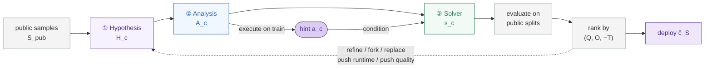

<h1 align="center">Distribution-Aware Algorithm Design with LLM Agents</h1>

<p align="center">
  <em>Learn the structure hiding in your problem distribution — then compile it into a solver that runs orders of magnitude faster.</em>
</p>

<p align="center">
  <a href="#-install"></a>
  <a href="https://github.com/DLFundamentals/Program_Learning"></a>
  <a href="#-citation"></a>
  <a href="#license"></a>
</p>

<p align="center">
  Saharsh Koganti<sup>1</sup> · Priyadarsi Mishra<sup>1</sup> · Pierfrancesco Beneventano<sup>2</sup> · Tomer Galanti<sup>1</sup><br>
  <sub><sup>1</sup>Texas A&amp;M University &nbsp;&nbsp; <sup>2</sup>Massachusetts Institute of Technology</sub>
</p>

---

## What this is

Most optimization problems are solved over and over against instances drawn from the same hidden process — a router, scheduler, compiler, or service sees a *distribution* of instances, not arbitrary worst cases. Even when the ambient problem is worst-case hard, that distribution often carries reusable structure: recurring geometry, latent decompositions, active-resource patterns, planted assignments.

This repository studies **distribution-aware program learning**: given only *samples* from an unknown deployment distribution, can we synthesize executable solver code that is fast on future instances while keeping solution quality high?

The central abstraction is a **solver hint** — distribution-specific structure inferred from samples and compiled into a specialized solver. The learner never sees the distribution analytically; it must discover what makes future instances easier and turn that into code:

$$
\underbrace{S \sim D^n}_{\text{samples}}
\xrightarrow{\text{ learn }}
\underbrace{\widehat{h}_S}_{\text{hint}}
\xrightarrow{\text{ compile }}
\underbrace{\widehat{c}_S = \mathrm{Comp}(\widehat{h}_S)}_{\text{deployed solver}}
$$

The samples are not used to predict solutions to observed instances — they are used to discover what makes *future* instances from the same source easier to solve.

`dasbench`, the framework in this repo, is a unified benchmark for **distribution-aware algorithm synthesis** on hard combinatorial problems, with an LLM code agent as the (approximate) sample → hint → solver procedure.

---

## Why it matters

Three access models for designing a solver against a distribution *D*:

<div align="center">

<table>
<thead>
<tr><th align="left">Access model</th><th align="left">Information about <em>D</em></th><th align="left">Learned representation</th></tr>
</thead>
<tbody>
<tr><td align="left">Worst-case design</td><td align="left">none</td><td align="left">none</td></tr>
<tr><td align="left">Average-case complexity</td><td align="left"><em>D</em> specified analytically</td><td align="left">none</td></tr>
<tr><td align="left"><strong>This work</strong></td><td align="left"><strong>samples&nbsp; S ~ D<sup>n</sup></strong></td><td align="left"><strong>hint ĥ<sub>S</sub> → solver ĉ<sub>S</sub></strong></td></tr>
</tbody>
</table>

</div>

We sit in the realistic middle ground: the distribution is observed only through examples. Correctness is handled by verification / repair / fallback, so the learned component is free to focus on the *shortcut* — a SAT backdoor, a graph separator, a geometric template, an active-constraint pattern — that makes deployment cheap.

---

## Headline results

Across **21 structured combinatorial-optimization distributions** spanning **7 problem classes**, the synthesized solvers reach **mean normalized quality 0.971** while running far faster than classical and solver-backed baselines.

<div align="center">

<table>
<thead>
<tr><th align="left">Comparator</th><th>Quality lift (Δ)</th><th>Faster than ours</th></tr>
</thead>
<tbody>
<tr><td align="left">Fast high-quality heuristic</td><td><strong>+0.109</strong></td><td><strong>564.9×</strong></td></tr>
<tr><td align="left">Gurobi (10&nbsp;s, 1&nbsp;thread)</td><td>—</td><td><strong>345.1×</strong></td></tr>
<tr><td align="left">Time-limited exact backend</td><td>—</td><td><strong>16.9×</strong></td></tr>
<tr><td align="left">One-shot Codex</td><td>−0.016 <em>(≈ tie)</em></td><td><strong>4.5×</strong></td></tr>
<tr><td align="left">One-shot Claude Code</td><td>+0.085</td><td><strong>17.4×</strong></td></tr>
<tr><td align="left">Best-of-5 open model (Gemma&nbsp;4)</td><td>+0.145</td><td>2.4×</td></tr>
</tbody>
</table>

</div>

> No single baseline is *both* faster and higher quality across the suite. The method improves the average quality–runtime frontier rather than dominating every family — it trails the strongest heuristic on TSP and the ML baseline on Coloring.

---

## How it works

For each candidate `c = (H_c, A_c, s_c)`, three sequential LLM calls produce a structured **hypothesis**, an **analysis program**, and a **deployment solver**. Executing the analysis on the public training sample yields the recovered **hint**, on which the solver is conditioned. Candidates are evaluated on public splits, ranked, and refined; the best one across all rounds is deployed.



1. **Hypothesis** `H_c` — a structured guess about the hidden distributional rule, the evidence to measure, and the implied solver strategy.
2. **Analysis program** `A_c` — runs once on the public training sample `S_pub` and compresses the evidence into a compact, reusable summary: the empirical hint `a_c = A_c(S_pub)`.
3. **Solver** `s_c` — deployment code mapping a new instance and the hint to a solution, `z = s_c(x, a_c)`, with a fallback for weak or ambiguous structure.

Candidates are generated in a diversity-preserving beam and ranked lexicographically by **(validation quality, optimality, −runtime)**. The public view is sanitized — family identity, planted rules, optimum solutions, and optimum objective values are stripped before any synthesized code runs. The agent sees only the instance format, the scoring rule, and the samples.

---

## What the agent compiles

The speedups are not just implementation effects — the selected solver often changes the *effective computation*, replacing a worst-case search with a distribution-specific procedure:

<div align="center">

<table>
<thead>
<tr><th align="left">Distribution structure</th><th>Ambient search</th><th align="left">Generated solver</th></tr>
</thead>
<tbody>
<tr><td align="left">MAXSAT: latent Boolean rules</td><td><code>O*(2^v)</code></td><td align="left">seeded assignment + bounded local repair</td></tr>
<tr><td align="left">Coloring: planted palettes</td><td><code>O*(κ^n)</code></td><td align="left">template check + DSATUR-style recolor</td></tr>
<tr><td align="left">MIS: motif structure</td><td><code>O*(2^n)</code></td><td align="left">greedy + tiny residual enumeration</td></tr>
<tr><td align="left">MDS: coverage kernels</td><td><code>O*(2^n)</code></td><td align="left">hub/gateway cover + bounded prune</td></tr>
<tr><td align="left">Packing / MDKP: resource bottlenecks</td><td><code>O*(2^N)</code></td><td align="left">density sort / surrogate price + repair</td></tr>
<tr><td align="left">TSP: latent geometry</td><td><code>O(n²·2^n)</code></td><td align="left">structured construction + bounded 2-opt</td></tr>
</tbody>
</table>

</div>

---

## External test — PACE 2025 Dominating Set

On the released **private** instances (large sparse graphs, up to ~4.2M vertices), the synthesized solver is the only method that is **both fully valid and fast**: valid on all 100 graphs and ~two orders of magnitude faster than the released competition solvers, for only ~3% larger sets. No baseline dominates it on the quality–runtime frontier.

<div align="center">

<table>
<thead>
<tr>
<th align="left">Solver</th><th>Valid</th><th>Avg. size ↓</th><th>Size vs. ours</th><th>Time (s) ↓</th><th>Speedup</th><th>Quality wins vs. ours</th>
</tr>
</thead>
<tbody>
<tr style="background:#efe7f9;">
<td align="left"><strong>GPT-5.2 (ours)</strong></td><td>100 / 100</td><td>231,595</td><td>1.00×</td><td><strong>2.89</strong></td><td><strong>1.0×</strong></td><td>—</td>
</tr>
<tr style="background:#f6f2fc;">
<td align="left"><strong>Gemma&nbsp;4 (ours)</strong></td><td>100 / 100</td><td>231,667</td><td>1.00×</td><td>6.03</td><td>2.1×</td><td>—</td>
</tr>
<tr><td align="left">AEG Heidelberg</td><td>100 / 100</td><td>224,086</td><td>1.034×</td><td>350.14</td><td>121.0×</td><td>99 / 100</td></tr>
<tr><td align="left">Fontan–Verger</td><td>100 / 100</td><td>224,107</td><td>1.033×</td><td>286.24</td><td>98.9×</td><td>100 / 100</td></tr>
<tr><td align="left">Root</td><td>100 / 100</td><td>224,108</td><td>1.033×</td><td>360.42</td><td>124.5×</td><td>100 / 100</td></tr>
<tr><td align="left">Shadoks</td><td>100 / 100</td><td>224,306</td><td>1.032×</td><td>316.07</td><td>109.2×</td><td>100 / 100</td></tr>
<tr><td align="left">Greeduce</td><td>100 / 100</td><td>224,699</td><td>1.031×</td><td>300.86</td><td>104.0×</td><td>91 / 100</td></tr>
<tr><td align="left">Swats <sup>*</sup></td><td>75 / 100</td><td>210,237</td><td>1.028×</td><td>218.11</td><td>75.4×</td><td>75 / 75</td></tr>
</tbody>
</table>

</div>

<sub><strong>Size vs. ours &gt; 1</strong> means the PACE solver returns a smaller dominating set; <strong>Speedup</strong> is how much faster ours runs. <sup>*</sup>Swats is valid on only 75/100 instances, so its size, speedup, and wins are computed on that matched subset. Exact-style baselines and Gurobi time out at the 360&nbsp;s cap; the learned ML baselines cannot run at this scale.</sub>

---

## Repository layout

```
Program_Learning/
├── dasbench/            # core framework: problems, families, baselines, exact solvers, synthesis loop
│   └── prompts/         # LLM system prompt used by the generator
├── benchmarks/          # paper-facing sweep suites and ablations (see benchmarks/README.md)
├── scripts/             # helper scripts
├── tests/               # test suite
├── main.py              # CLI entry point: generate / run-agent / report / benchmark
├── REPRODUCIBILITY.md   # full reproduction notes incl. PACE 2025 diagnostic
├── pyproject.toml
└── .env.example
```

Generated datasets, candidates, and reports are written under `artifacts/` and are intentionally **not** committed — regenerate them with the commands below.

```
artifacts/datasets/<problem>/<family>/<dataset_id>/
artifacts/agent_runs/<problem>/<family>/<run_id>/
artifacts/reports/<problem>/<family>/<run_id>/
```

---

## 📦 Install

```bash
uv sync
```

For the LLM generator, set the OpenAI-compatible environment variables (see `.env.example`):

```bash
OPENAI_API_KEY=YOUR_OPENAI_API_KEY
OPENAI_MODEL=gpt-5.2
OPENAI_REASONING_EFFORT=xhigh
# Optional, for OpenAI-compatible endpoints:
# OPENAI_BASE_URL=https://api.openai.com/v1
```

The **template generator** is fully local and is the recommended smoke-test path — no API key required.

---

## 🚀 Quick start

**Generate a dataset** (stores exact optima with each instance):

```bash
python main.py generate \
  --problem mis \
  --family motif_bridge_mixture_v1 \
  --dataset-id smoke_mis \
  --instance-param num_vertices=18 \
  --train-size 32 --validation-size 16 --test-size 16
```

**Run baselines + synthesis** on an existing dataset:

```bash
python main.py run-agent \
  --dataset-dir artifacts/datasets/mis/motif_bridge_mixture_v1/smoke_mis \
  --generator template \
  --mode beam --iterations 3 --beam-width 3
```

**Write a repeated benchmark report** for a completed run:

```bash
python main.py report \
  --dataset-dir artifacts/datasets/mis/motif_bridge_mixture_v1/smoke_mis \
  --agent-run-dir artifacts/agent_runs/mis/motif_bridge_mixture_v1/<run_id> \
  --repeats 10
```

**Run the full flow end to end** for one family:

```bash
python main.py benchmark \
  --problem mds --family gateway_overlap_cover_v1 \
  --generator template \
  --instance-param num_vertices=20 \
  --train-size 64 --validation-size 32 --test-size 32
```

**Run every family** for one problem, or across all problems (parallel by default):

```bash
python main.py benchmark --problem maxsat --all-families
python main.py benchmark --all-families --max-parallel 4
```

### Optional baselines

The default-on timed **Gurobi** industrial baseline can be disabled or tuned:

```bash
python main.py run-agent --dataset-dir <dir> --no-gurobi-baseline
python main.py run-agent --dataset-dir <dir> --gurobi-time-limit-seconds 30 --gurobi-threads 1
```

Optional **external exact solvers** are discovery-based via `auto`. In `auto` mode, configured binaries take precedence; without one, MaxSAT rows fall back to `hermax` (Open-WBO / UWrMaxSAT / EvalMaxSAT / WMaxCDCL), SCIP rows to `pyscipopt`, and HiGHS rows to `highspy`. MaxHS, KaMIS, and Concorde remain CLI-based.

```bash
export DASBENCH_OPEN_WBO_BIN=/path/to/open-wbo
export DASBENCH_CONCORDE_BIN=/path/to/concorde
# ... see .env.example for the full list

python main.py run-agent \
  --dataset-dir artifacts/datasets/maxsat/last_clause_signal_v1/smoke_maxsat \
  --external-exact-baselines auto \
  --external-time-limit-seconds 60 --external-threads 1
```

### Paper sweeps

```bash
python -m benchmarks.main_paper_benchmark --max-workers 21
python -m benchmarks.sample_size_sweep --validation-size 32 --max-workers 4
python -m benchmarks.problem_size_sweep --max-workers 4
python -m benchmarks.candidate_count_sweep --max-workers 4
```

The headline paper results use `benchmarks.main_paper_benchmark` (a wrapper over `benchmarks.second_scale_benchmark_v2`). Additional ablations and the PACE 2025 diagnostic are documented in [`benchmarks/README.md`](benchmarks/README.md) and [`REPRODUCIBILITY.md`](REPRODUCIBILITY.md).

---

## Benchmark suite

7 problem classes × 3 hidden distribution families = **21 targets**. Each target is a *distribution* over structured instances (not arbitrary worst cases), split into train / validation / test with stored exact optima.

<div align="center">

<table>
<thead>
<tr><th align="left">Problem</th><th align="left">Families</th><th align="left">The exploitable signal</th></tr>
</thead>
<tbody>
<tr>
<td align="left"><strong>Coloring</strong></td>
<td align="left"><code>cluster_ring_mix_v1</code><br><code>planted_palette_overlap_v1</code><br><code>separator_palette_trap_v1</code></td>
<td align="left">Recover a global planted palette / separator structure instead of coloring greedily.</td>
</tr>
<tr>
<td align="left"><strong>MAXSAT</strong></td>
<td align="left"><code>last_clause_signal_v1</code><br><code>latent_backdoor_mixture_v1</code><br><code>community_parity_overlay_v1</code></td>
<td align="left">Anchor bits / latent backdoors determine most variables via hidden Boolean rules.</td>
</tr>
<tr>
<td align="left"><strong>MIS</strong></td>
<td align="left"><code>clique_path_mix_v1</code><br><code>motif_bridge_mixture_v1</code><br><code>core_fringe_trap_v1</code></td>
<td align="left">Decompose into motifs / blocks and handle bridge conflicts and core-fringe traps.</td>
</tr>
<tr>
<td align="left"><strong>MDS</strong></td>
<td align="left"><code>star_cluster_cover_v1</code><br><code>gateway_overlap_cover_v1</code><br><code>geometric_cluster_cover_v1</code></td>
<td align="left">Pick stable hubs / gateways for overlap-aware coverage, not raw degree.</td>
</tr>
<tr>
<td align="left"><strong>Packing LP</strong></td>
<td align="left"><code>single_bottleneck_fractional_v1</code><br><code>latent_active_basis_v1</code><br><code>block_coupled_resource_v1</code></td>
<td align="left">Infer the binding resource / active basis and sort by value per unit of it.</td>
</tr>
<tr>
<td align="left"><strong>MDKP</strong></td>
<td align="left"><code>single_resource_density_v1</code><br><code>latent_class_knapsack_v1</code><br><code>decoy_complement_mixture_v1</code></td>
<td align="left">Identify the recurring bottleneck and prefer complementary, low-pressure bundles.</td>
</tr>
<tr>
<td align="left"><strong>TSP</strong></td>
<td align="left"><code>clustered_euclidean_v1</code><br><code>paired_ribbon_zigzag_v1</code><br><code>latent_metric_mixture_v1</code></td>
<td align="left">Classify the latent geometry and construct tours that respect it.</td>
</tr>
</tbody>
</table>

</div>

The candidate interface is intentionally minimal — each candidate directory provides:

- `analyze.py` → `analyze(train_instances, manifest=None) -> dict`
- `solution.py` → `solve(instance, analysis=None, manifest=None) -> object`

LLM-generated candidates additionally store `hypothesis.json`, the agent's explicit guess about the hidden rule, the evidence to measure, and the implied solver strategy.

---

## Metrics

Every problem reports `average_normalized_quality`, `optimality_rate`, `feasibility_rate`, and `average_runtime_ms` (external exact baselines additionally report `proved_optimal_rate` and `average_external_runtime_ms`). Quality is normalized to **[0, 1]** where **1.0** is optimal and invalid/infeasible outputs score **0**:

<div align="center">

<table>
<thead>
<tr><th align="left">Problem</th><th align="left">Normalized quality</th></tr>
</thead>
<tbody>
<tr><td align="left">Coloring</td><td align="left"><code>k_opt / k_alg</code></td></tr>
<tr><td align="left">MAXSAT</td><td align="left"><code>sat_alg / sat_opt</code></td></tr>
<tr><td align="left">MIS</td><td align="left"><code>|IS_alg| / |IS_opt|</code></td></tr>
<tr><td align="left">MDS</td><td align="left"><code>|DS_opt| / |DS_alg|</code></td></tr>
<tr><td align="left">Packing LP, MDKP</td><td align="left"><code>obj_alg / obj_opt</code></td></tr>
<tr><td align="left">TSP</td><td align="left"><code>len_opt / len_alg</code></td></tr>
</tbody>
</table>

</div>

**Notes.** Exact optima are computed at generation time and stored per instance. OR-Tools is the exact backend for graph problems and the packing pair (`GLOP` for `packing_lp`, CP-SAT for `mdkp`). Gurobi is a *timed industrial baseline only* and never replaces stored-optimum generation. The LLM generator uses structured outputs and the system prompt in [`dasbench/prompts/llm_system_prompt.txt`](dasbench/prompts/llm_system_prompt.txt).

---

## Theory in brief

**Runtime-aware library selection.** For a fixed solver class $\mathcal{C}$, the empirically *fastest sample-consistent* solver $\widehat{c}_S$ generalizes in both correctness and runtime. With probability at least $1 - \delta$ over $S \sim D^n$,

$$
\mathrm{Run}_D(\widehat{c}_S) \le \inf_{c \in \mathcal{C}^{\text{feas}}} \mathrm{Run}_D(c) + O\!\left( T_{\max} \sqrt{\frac{\log |\mathcal{C}|}{n}} \right)
$$

so it approaches the best *correct* distribution-specialized solver in the class, while sample consistency controls deployment error.

**Hint recovery.** For an identifiable hint class with score margin $\gamma > 0$ over $N$ candidates,

$$
n \ge \frac{2}{\gamma^2} \log \frac{2N}{\delta}
$$

samples suffice to recover the hidden hint $h^\star$ exactly with probability at least $1 - \delta$ — logarithmic in $N$, inverse-quadratic in the margin.

**A concrete instance — hidden SAT backdoors.** Here samples improve *computation* without ever learning correctness: a complete solver is always available, fallback preserves validity, and the recovered backdoor $\widehat{B}$ yields per-instance runtime $O(2^{k}\,\mathrm{poly}(|F|))$ on the deployment distribution. Proofs are in the paper appendix.

---

## Limitations

The one-time synthesis cost only pays off when amortized over enough future instances. Because the solver is specialized to the sampled regime, its advantage can degrade under distribution shift (a perturbation ablation in the paper quantifies this). The method is **complementary to**, not a replacement for, general-purpose solvers — and because the search explores a rich program space, different runs may recover different hints or brittle shortcuts.

---

## 📚 Citation

If you use this work, please cite:

```bibtex
@misc{koganti2026distributionawarealgorithmdesignllm,
      title={Distribution-Aware Algorithm Design with LLM Agents},
      author={Saharsh Koganti and Priyadarsi Mishra and Pierfrancesco Beneventano and Tomer Galanti},
      year={2026},
      eprint={2605.14141},
      archivePrefix={arXiv},
      primaryClass={cs.AI},
      url={https://arxiv.org/abs/2605.14141},
}
```

## License

See the repository for license details.
